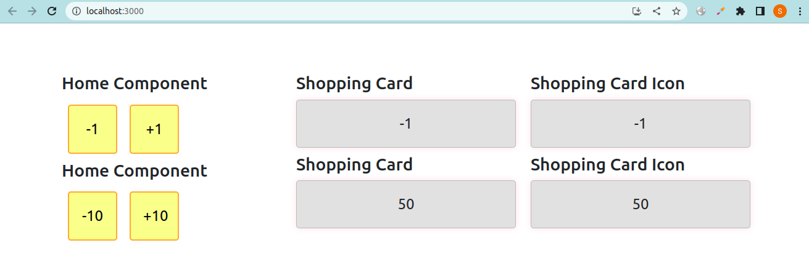
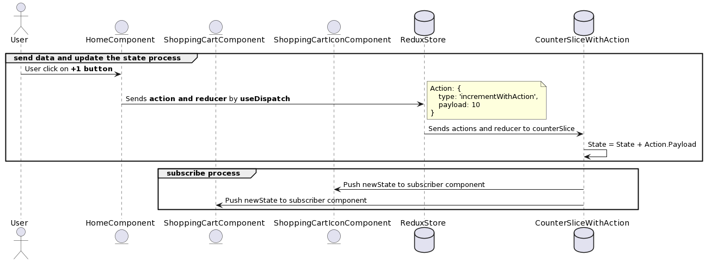

# A simple counter app using Redux Toolkit



This is a simple counter application built using Redux. The app consists of three main components: Home, ShoppingCart, and ShoppingCartIcons. The Home component is responsible for sending data to the counterSlice of the Redux store, which contains the current value of the counter. The two buttons in the Home component, labeled "+1" and "-1", are used to increase and decrease the value of the counter.

# Sequence Diagram


# Installation

**`npm install @reduxjs/toolkit`**

**`npm install react-redux`**

# Source Code

## Store
**create store.js**
```js
import { configureStore } from '@reduxjs/toolkit'
import counterSlice from './counterSlice';

const store = configureStore({
  reducer: {
    counterSlice: counterSlice.reducer
  }
})

export default store;
```

## Slice
**create counterSlice.js**
```js
import { createSlice } from '@reduxjs/toolkit'

const counterSlice = createSlice({
    name: 'counter',
    initialState: {
      value: 0
    },
    reducers: {
      incremented: state => {
        state.value += 1
      },
      decremented: state => {
        state.value -= 1
      }
    }
  })
  
  export const { incremented, decremented } = counterSlice.actions
  export default counterSlice;
```
## App.js
```js
import Home from './component/Home';
import ShoppingCart from './component/ShoppingCart';
import ShoppingCartIcons from './component/shoppingCartIcons';
import { Provider } from 'react-redux';
import store from './redux/store'

function App() {
  return (
    <Provider store={store}>
        <Home />
        <ShoppingCart />
        <ShoppingCartIcons />
    </Provider>
  );
}

export default App;
```

## HomeComponent
***send data to store***
```js
import { useDispatch } from 'react-redux';
import { incremented, decremented } from '../redux/counterSlice'

function Home() {
    const dispatch = useDispatch();

    return (
        <>
            <h3>Home Component</h3>
            <button onClick={() => dispatch(decremented())}>-1</button>
            <button onClick={() => dispatch(incremented())}>+1</button>
        </>
    )
}
export default Home;
```

## ShoppingCard
***subscriber componenets***
```js
import { useSelector } from 'react-redux';

function ShoppingCart() {
    const counter = useSelector(state => state.counterSlice.value);

    return (
        <>
            <h3>Shopping Card</h3>
            <div>{counter}</div>
        </>
    )
}
export default ShoppingCart;
```

## ShoppingCardIcon
***subscriber componenets***
```js
import { useSelector } from 'react-redux';

function ShoppingCartIcons() {
    const counter = useSelector(state => state.counterSlice.value);

    return (
        <>
            <h3>Shopping Card Icon</h3>
            <div>{counter}</div>
        </>
    )
}
export default ShoppingCartIcons;
```
# Sources
- [Getting Started with Redux Toolkit](https://redux-toolkit.js.org/introduction/getting-started)